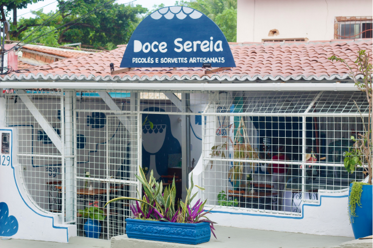

# Doce Sereia 🧜‍♀️🍦
Esse site foi criado para a disciplina de Design Web e Arquitetura da Informação.
Esse site foi criado para a disciplina de Design Web e Arquitetura da Informação.

Tema: Doce Sereia — Uma sorveteria super aconchegante em Ponta Negra, Natal/RN. O lugar é perfeito para quem quer relaxar e curtir um ambiente lindo, além de oferecer sorvetes artesanais, naturais e, claro, deliciosos.

O site foi feito para refletir a vibe da Doce Sereia. Com um design simples e fácil de navegar, ele permite que você acesse o cardápio, faça pedidos para delivery, descubra os sabores disponíveis, entre em contato com a sorveteria e conheça mais sobre o estabelecimento.

## Link do GitHub Pages

Acesse o site hospedado no GitHub Pages:  
[Visite o site!]( erm2k8.github.io/Doce-Sereia/ )

## Tecnologias Usadas

